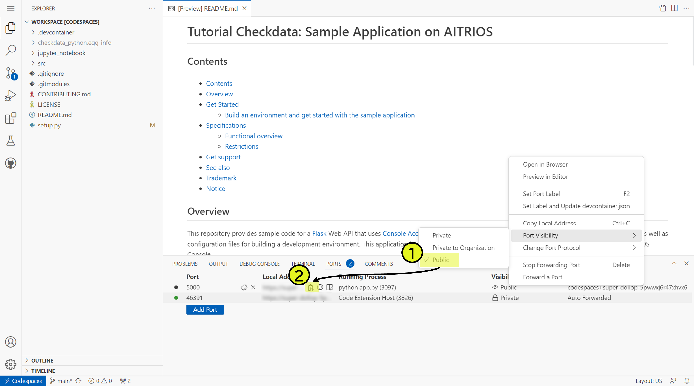

# Tutorial Checkdata: Sample Application on AITRIOS

## Contents

- [Contents](#contents)
- [Overview](#overview)
- [Get Started](#get-started)
  - [Build an environment and get started with the sample application](#build-an-environment-and-get-started-with-the-sample-application)
- [Specifications](#specifications)
  - [Functional overview](#functional-overview)
  - [Restrictions](#restrictions)
- [Get support](#get-support)
- [See also](#see-also)
- [Trademark](#trademark)
- [Notice](#notice)

## Overview

This repository provides sample code for a [Flask](https://flask.palletsprojects.com/en/2.3.x/) Web API that uses [Console Access Library for Python](https://github.com/SonySemiconductorSolutions/aitrios-sdk-console-access-lib-python) to respond inference results to a [frontend application (aitrios-sample-application-check-data-tool-ts)](https://github.com/SonySemiconductorSolutions/aitrios-sample-application-check-data-tool-ts), as well as configuration files for building a development environment. This application builds an API to retrieve and return object detection based metadata from Console.

## Get Started

### Build an environment and get started with the sample application

1. Clone or fork this application in your GitHub environment.
2. Click the `+` button to create a codespace on the GitHub environment. See [how to create a codespace](https://docs.github.com/en/codespaces/developing-in-codespaces/creating-a-codespace-for-a-repository).
3. Create console access setting configuration file with real values under [src/data_loader/common/config/](./src/data_loader/common/console_access_settings.yaml.sample).
    `src/data_loader/common/console_access_settings.yaml`

    ```yaml
    console_access_settings:
        console_endpoint: "__console_endpoint__"
        portal_authorization_endpoint: "__portal_authorization_endpoint__"
        client_secret: "__client_secret__"
        client_id: "__client_id__"
    ```

    > **Note**
    > - Specify the base URL
    > - Specify the token URL
    > - Specify registered application secret for client_secret
    > - Specify registered application client ID for client_id

    See the [Portal user manual](https://developer.aitrios.sony-semicon.com/en/edge-ai-sensing/documents/portal-user-manual/) for details.
4. Run the sample application using the following command.

    ```sh
    $ cd ./src
    $ flask run --debugger --reload
    ```

5. Open `localhost:5000` in a browser and verify that the application is running.

    > **Note**
    > Please check only for codespaces users!
    >
    > **Public Ports (Front-end application link)**  
    > To link with the front-end application, follow the steps below to make the port on codespaces public.
    > 1. Open a terminal and open the [Port] tab. Right-click on the port that will be shared and, after clicking on [Port Display Range], click on [Public].
    > 2. Click on the copy icon on the right side of the port’s local adress and copy it.
    >



## Specifications

### Functional overview

- Web API to obtain various datas from Console.
  - An API that can be obtained a list of Edge Devices connected to Console.
  - An API that can be obtained a list of sub-directories containing images taken with the specified device.
  - An API that can be obtained a list of pairs of image and inference result that stored in Console.
- Only object detection made by Custom Vision is supported.
- It can be run on devcontainer/codespaces.

### Restrictions

None

## Get support

- [Contact us](https://developer.aitrios.sony-semicon.com/en/edge-ai-sensing/contact-us/)

## See also

- [Get Started](https://developer.aitrios.sony-semicon.com/en/edge-ai-sensing/guides/)
- [aitrios-sdk-console-access-lib-python](https://github.com/SonySemiconductorSolutions/aitrios-sdk-console-access-lib-python)
- [aitrios-sdk-cloud-app-sample-python](https://github.com/SonySemiconductorSolutions/aitrios-sdk-cloud-app-sample-python)

## Trademark

- [Read This First](https://developer.aitrios.sony-semicon.com/en/edge-ai-sensing/guides/)

## Notice

### Security

Before using Codespaces, please read the Site Policy of GitHub and understand the usage conditions.
